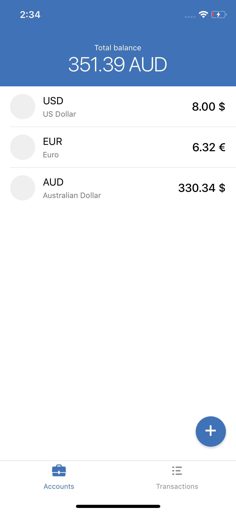

Example project. 



**Instructions**

```shell
npm i
```

```shell
react-native run-ios
```


**Libraries used**

- jest. Testing
- lodash. Data manipulation
- moment. Split transactions by days and show day in human readable format
- normalizr. Normalize currency data from server
- numeral. To format money amount like 21,333.22
- react-native-touch-id. Touch ID / Face ID support
- react-native-vector-icon. Some icons.
- react-navigation. Navigation between screens.
- redux-api-middleware. Communication with 3rd party API (currency / exchange data)
- redux-form. Input validation / normalization
- uuid. Each TX having unique UUID
- eslint-config-airbnb. Linter config

**Caveats**

- Code coverage by tests is not 100%. I added some tests just to show some experience. Also in production app should be added e2e tests using Detox.

- No Touch ID on login.

- No icons for TX and accounts, just gray circle. 

  

Feel free to contact me at sergey@szhukov.com
